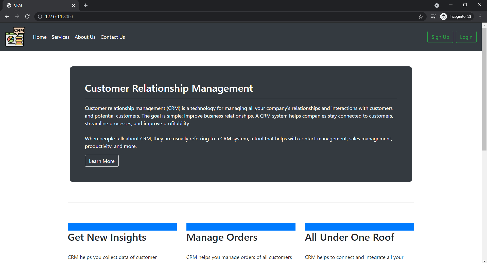
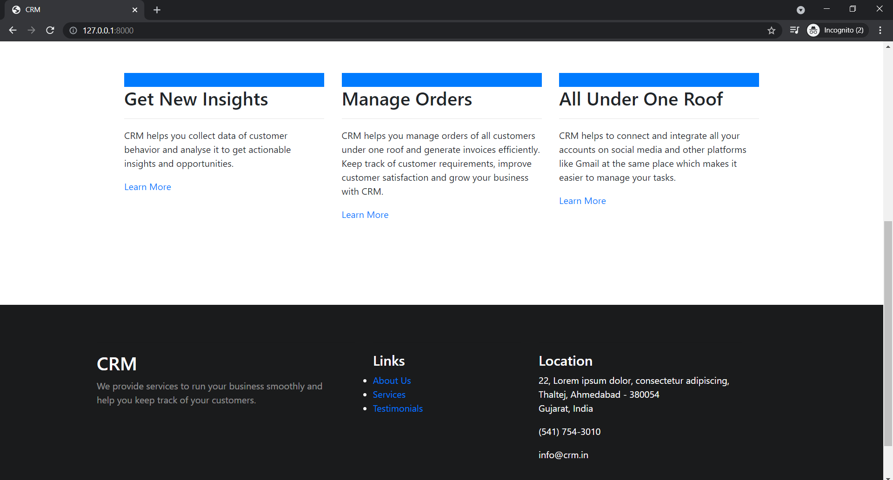
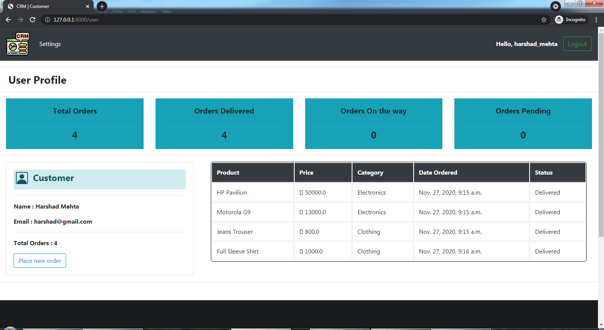
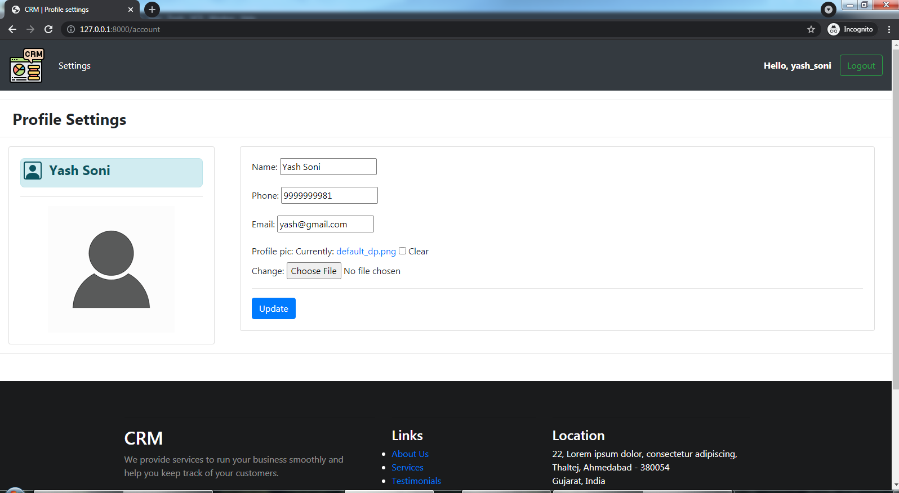
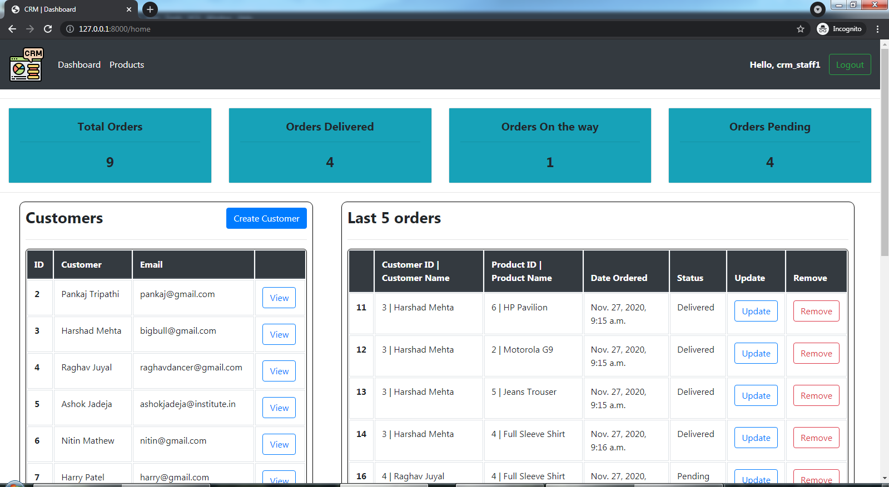
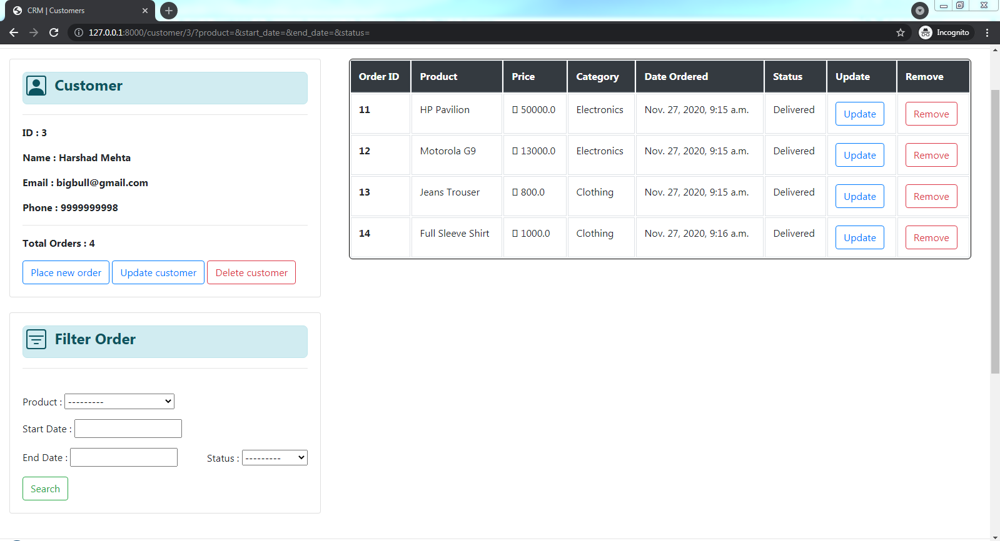

# crm-functionalities-django
CRM feature - Order Tracking for Staff and Admins

This project is the implementation of one of the features of any CRM software, that is, order tracking and management.
It is implemented using Django framework.

Following are some snapshots which may give a better idea.

